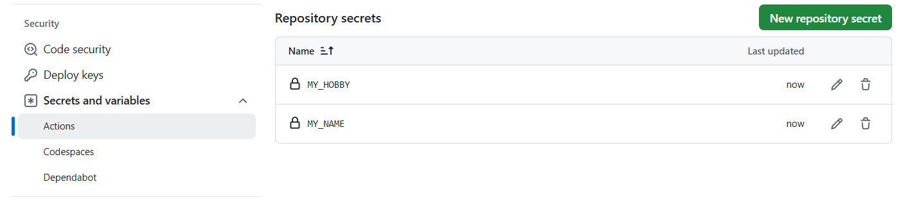

# github-actions-basic
Study github-actions for CI/CD

## CI/CD에 대하여
1. CI/CD란, Continuos integration, Continuos Deploy라는 의미
2. 즉 테스트(test), 통합(merge), 배포(deploy) 과정을 자동화하는 것
3. 결국 반복적인 작업을 개선하기 위해서 탄생한 개념
4. CI/CD 툴은 GitHub Actions와 Jenkins가 있음
5. Jenkins 사용 시, 별도의 서버에 구축을 해야한다는 단점이 있음
6. **GitHub Actions**는 무료사용이 가능하며, 빌드용 서버가 필요없음

7. (카카오엔터프라이즈에서는 Github Actions 사용중...)
 
 <br>
 
  

<br>

## 기본 문법
1. .github 폴더 생성
2. .github > workflow 폴더 생성
3. workflow > xxx.yml 파일 생성 및 작성
    - workflow 사용 시, Token 인증이 필요합니다.
    - git init 후, repo를 생성하고 push를 합니다.

4. .yml 코드 블럭 설명
```yml
# yml 파일은 하나의 Workflow를 의미합니다.
# name은 workflow의 이름입니다.
name: Github Actions 실행시켜보기

# Event : 언제 workflow를 실행시키고 싶은지 결정하는 부분
# 즉 master branch에 push가 되었을 때, 실행한다는 의미입니다.
on:
  push:
    branches:
      - master
      
# 어떤 실행을 할지 결정하는 부분
# 하나의 Workflow는 1개 이상의 Job으로 구성됩니다.
# 여러 Job은 기본적으로 병렬적으로 수행됩니다.
jobs:
  # My-Deploy-Job은 Job을 식별하기 위한 id
  My-Deploy-Job:
    # ubuntu 환경 / 가장 최신 버전(latest)
    runs-on: ubuntu-latest

    # Step : 특정 작업을 수행하는 가장 작은 단위
    # Job은 여러 Step들로 구성되어 있다.
    # Step 마다 name을 붙일 수 있고, 리눅스 명령어를 사용
    steps:
      - name: Hello World 찍기
        run: echo "Hello World"
```

- GitHub Actions에 내장된 변수값 호출
- 값의 보안을 위한 Setting에서 Secret 변수 생성 후 호출
```yml
      - name: Github Actions 자체에 저장되어 있는 변수 사용해보기
        run: |
          echo $GITHUB_SHA
          echo $GITHUB_REPOSITORY

      - name: 아무한테 노출이 되면 안되는 값
        run: |
          echo ${{ secrets.MY_NAME }}
          echo ${{ secrets.MY_HOBBY }}
```

